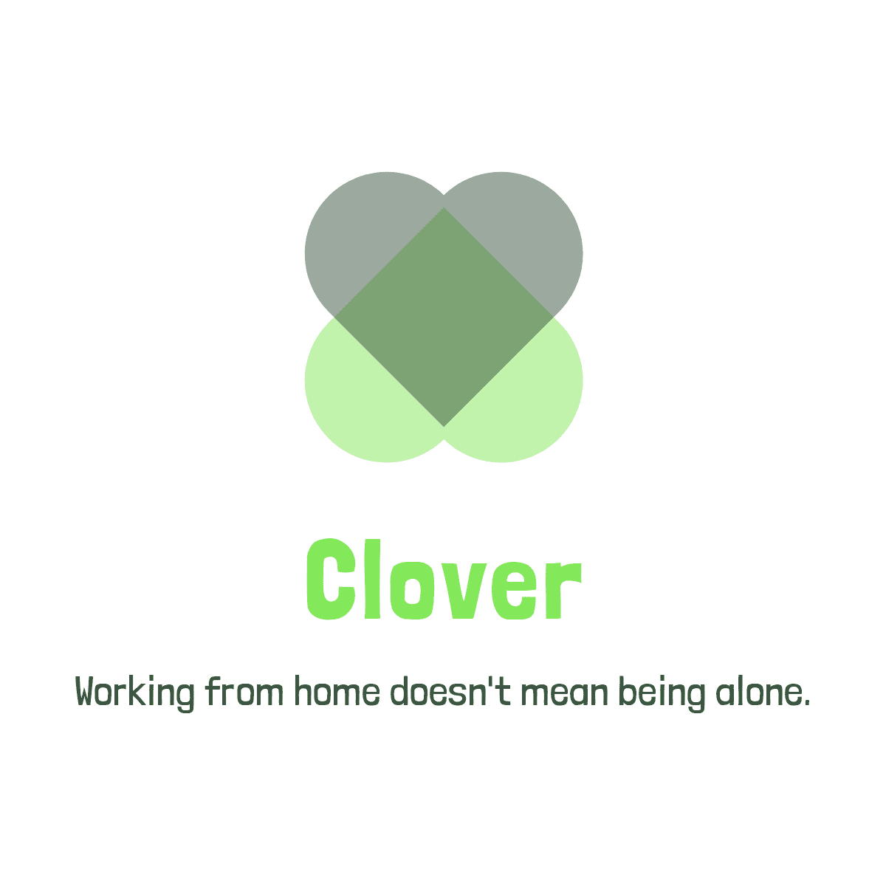

<h1 align="center"><a href="https://lexach91.github.io/team-5-january-hackathon/"></img></a></h1>

Table of Contents

 

* [About Clover](#about-clover)
* [UX](#ux)
    * [User Stories](#user-stories)
* [Features](#features)
    * [Existing Features](#existing-features)
    * [Features left to Implement](#features-left-to-implement)
* [Testing](#testing)
    * [Testing the features](#testing-the-features)
    * [Responsive Testing](#responsive-testing)
    * [validator Testing](#validator-testing)
        * [HTML5](#html)
        * [CSS3](#css3)
        * [Lighthouse](#lighthouse)
            * [Performance](#performance)
            * [Accessibilty](#accessibilty)
            * [Best Practices](#best-practices)
            * [Search Engine Optimization](#search-engine-optimization)
* [Deployment](#deployment)
    * [Version Control](#version-control)
    * [GitHub Pages](#github-pages)
    * [How to clone this Repository](#how-to-clone-this-repository)
* [Technologies Used](#technologies-used)
* [Credits](#credits)

 

(Image of responsive layout on screens or main page)
# About Clover

Clover was created with users working from home in mind. With the global pandemic of the previous two years, things have shifted dramatically within work places. We want to assist folks who are having trouble working from home. The website has a lot of resources for people to look over in order to get relevant information. It's critical that people realize they're not fighting alone in whatever battle they're now engaged in. We hope to generate participation from you and look forward to hearing from you.

Heres a link to the [website](https://lexach91.github.io/team-5-january-hackathon/).

# UX

## User Stories

* As a user, I would like to be able to browse the website.
* As a user, I would like to know more about Clover.
* As a user, I would like to sign up for a newsletter.
* As a user, I would like to find Clover on other websites.
* As a user, I need to be able to contact Clover.
* As a user, it is important I understand how to use the website.

### (sub headings, UX planes, strategy, scope, structure, skeleton, surface)

[Back to the top of page](#about-clover)

# Features
## Existing Features

* Home page
* Main image
* 4 internal pages
* Newsletter
* sign up form

## Features left to implement

[Back to the top of page](#about-clover)

# Technologies Used
* [HTML5](https://en.wikipedia.org/wiki/HTML5) was used to structure webpages.
* [CSS3](https://en.wikipedia.org/wiki/CSS) used for styling the website.
* [JavaScript](https://www.javascript.com/) was used to add interative content.
* [Git](https://git-scm.com/) was our version control system.
* [GitPod](https://www.gitpod.io/) was used as local IDE and repository.
* [GitHub](https://github.com/) as our remote repository.
* [Visual Studio Code](https://code.visualstudio.com/) was used as local IDE and repository.
* [Hatchful](https://hatchful.shopify.com/) was used to create our brand logo.
* [videoplayer](https://videojs.com/) for our video plugins.
* [hamburgers](https://jonsuh.com/hamburgers/) for the hamburger menu.
* [smtpjs](https://smtpjs.com/) to send email.
* [elasticemail](https://elasticemail.com/) - to host smtp server.
* [gmail](https://www.google.com) - for mail address.
* [jokes api](https://v2.jokeapi.dev) API for the jokes.
* [activities api](boredapi.com) API for the ativities.
* [quotes api](https://api.quotable.io) API for the quotes.
* [facts api](https://uselessfacts.jsph.pl) API for the facts.
* [video.js](https://github.com/videojs/videojs-youtube) - plugin to play youtube videos through .

[Back to the top of page](#about-clover)

# Testing
## Testing the Features

### Home page

- Expected results:
- Actual results:
- User Stories fufilled:
 
### Main image

- Expected results:
- Actual results:
- User Stories fufilled:
 
### 4 internal pages

- Expected results:
- Actual results:
- User Stories fufilled:
 
### Newsletter

- Expected results:
- Actual results:
- User Stories fufilled:

### sign up form

- Expected results:
- Actual results:
- User Stories fufilled:

## Responsive Testing
This website was built as a desktop first solution with adjustments then made for smaller devices.

Below is a table we used to keep track of adjustments and to test adjustments made. 

- A = Adjusted
- n/a = Not affected
- X = Not included

|Features - Widths| 1570px | 1350px | 1050px | 970px | 768px |485px |
| --- | --- | --- | --- | --- | --- | --- |
| Navigation bar |||||||
| Home page |||||||
| Main images|||||||
| About |||||||
| Stress page|||||||
| Exercise page|||||||
| Concentration page|||||||
| Sleep page|||||||

## Validator Testing
### HTML5
The HTML was tested using the [W3C validator](https://validator.w3.org/). To do this we put the URL of each webpage into the validator.

### CSS3
The CSS was tested using the [W3C validator](https://validator.w3.org/). We did a direct input for our CSS file.

### Lighthouse
To test our websites performance, accessibility, best practices and SEO we used [Chrome Developer Tools](https://developer.chrome.com/docs/devtools/) resource [Lighthouse](https://developers.google.com/web/tools/lighthouse).

#### Performance
(contents here)

#### Accessibility
(contents here)

#### Best Practices
(contents here)

#### Search Engine Optimization
(contents here)

[Back to the top of page](#about-clover)

# Deployment

## Version Control

We used GitPod and Visual Studio Code as a local repository and IDE & GitHub as a remote repository.

Process for GitPod:

1. The repository was created on GitHub and we gave it the named team-5-january-hackathon.
2. We then opened that repository on GitPod by prefixing 'gitpod.io/' to the URL at the top of the page within this repository.
3. GitPod opened new workspaces for us to use.
4. Opened a new terminal.

Process for Visual Studio Code:

1. We opened VS code on our local machines.
2. Made sure we had git installed.
3. Opened a new terminal.

Together using our terminals:

1. We each created a new branch for each of us to use by typing: git name-of-branch
2. We navigated to our branches by typing: git switch name-of-branch

Once we were in our branches we used:

1. **git pull origin main** This pulls all data from the main branch.
2. **git add name-of-file** This adds a file to be committed.
3. **git commit -m "Commit message"** This allows us to attach a message to our committed code.
4. **git push origin name-of-branch** This final command pushes our work to a branch of our choosing.

## GitHub Pages

As a deployment solution to our project we chose to use 'GitHub Pages'. This is a resource a developer can use to test how their websites look on a cloud platform.

Here are the steps we took to deploy our website.

1. In the repository we selected 'settings'.
2. Within the options on the left middle of the screen we navigated to the 'pages' section.
3. We then selected a branch to test.
4. Once this was completed we received a URL for the website.

## How to clone this Repository

Below is a list of steps to help you clone this repository:

1. Please log in to your GitHub account to get started.
2. Then create a new repository within your account and give it a name.
3. In this repository at the top of the page click the green button labelled 'code'.
4. Choose the HTTPS option and copy the URL link you see to your clipboard.
5. You will need to open your 'IDE' and have 'git' installed.
6. Once you have git installed open a terminal.
7. Type: git clone URL-from-this-repository

Once steps 1 - 7 are completed you will now have a clone of this repository on your local machine to use.

[Back to the top of page](#about-clover)

# Credits
(contents here)
[Back to the top of page](#about-clover)